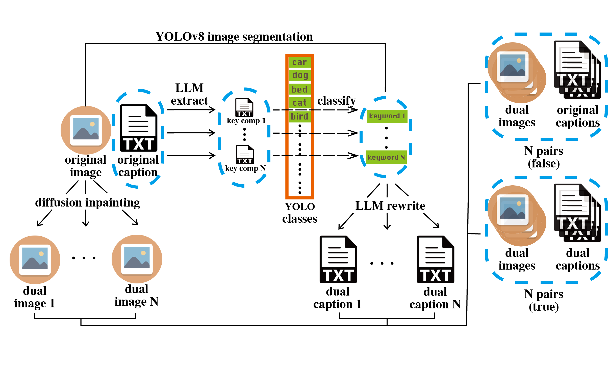
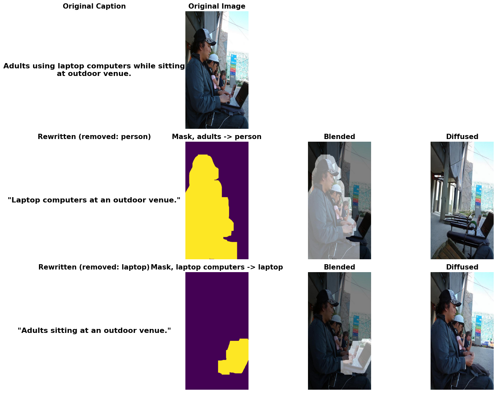

# Intro

Contrastive Language–Image Pretraining(CLIP) excels in multimodal learning, enabling zero-shot classification, cross-modal retrieval, and transfer learning. However, its reliance on global image-text alignment limits its ability to capture localized features, weakening performance in fine-grained visual tasks.To address this, we propose DeCLIP, which introduces image-based hard negatives by modifying key image-caption pairs, enhancing model robustness and discrimination. This improves CLIP’s ability to distinguish fine-grained details, strengthening its effectiveness in contrastive learning and multimodal tasks.

## Pipeline

### example of dual (image, caption)s' generation with DeCLIP

