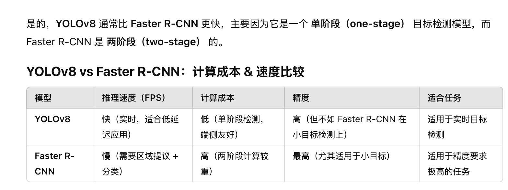

我现在对于一张图片和一句文字的 pair, 需要做这三件事情：

指定 N = 3.

1. 提取出这个句子中的 N 个关键词
2. 

Let N = 3 e.g.

Given a sentence, can you give me some 

给定一个图片和几个关键词, 现有的 image captioning 方法中, 最高效地从这个图片中 framing 这些关键词对应的物体

（通常，我们需要用 CLIP 本身来首先判断这个图片是否包括关键词对应的物体，但是我们这里只对 true examples 进行操作, 这些 examples 中一定包含对应文字中描述的物体，所以直接 framing 即可.）

比如给定 "cat", 提取出我给出的这张图片中的 cat 成分:

要求: 时间和计算成本小

GPT: **YOLOv8 或 Faster R-CNN**（计算成本较低）来识别图像中的物体并框选出所有可能的对象。

Faster R-CNN 对小对象检测效果更好，而 YOLOv8 计算速度更快。

**ImageNet**（1400 万张图像，1000 个类别标签）：

- 虽然 ImageNet 本身不是图像-文本数据集，但 CLIP 通过 zero-shot 方式在 ImageNet 进行测试，表现与 ResNet50 相当。

For image 

中期：在 MS-COCO 上进行训练 （约 33 万张图像，每张图像 5 个描述）

后期：在 **CC3M (Conceptual Captions 3M)**）（300 万个图像-文本对）上进行训练

